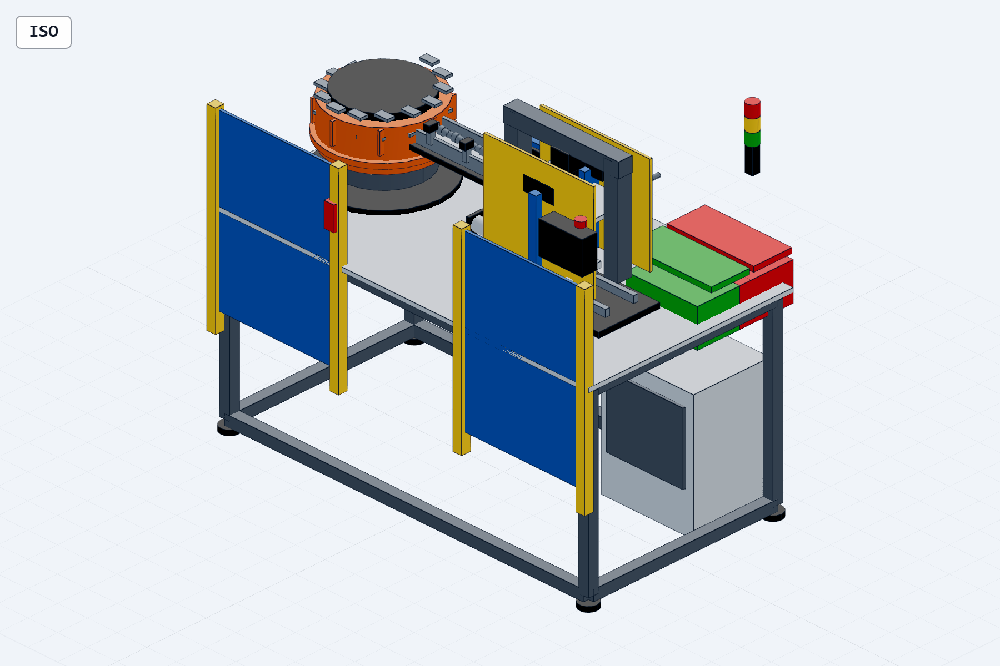
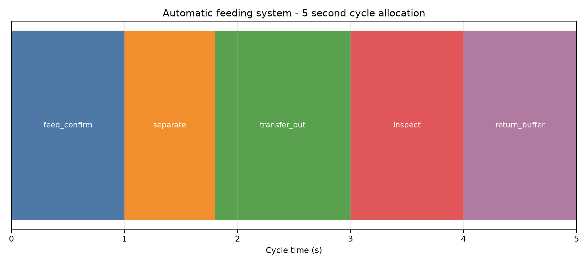
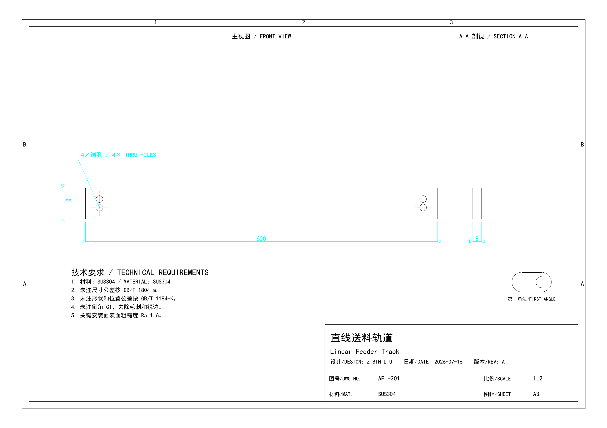

# 自动上料与视觉检测系统

面向 60 × 20 mm、约 0.12 kg 阶梯轴的自动定向上料、单件分离、V形定位、视觉/激光检测及 OK/NG 分流工作站。设计节拍为 12件/分钟，即5秒/循环。

## 项目内容

- 振动盘、螺旋轨道和直线送料轨道
- 双气缸分料、移载滑台、V形定位及到位传感
- 工业相机、远心镜头、背光源和激光测微
- OK/NG 气动分流、HMI、安全门联锁和防护
- 五秒循环时序、0.1秒状态采样和互锁矩阵
- 参数化整机、关键零件、工程图、BOM及气动计算

## 核心结果

| 项目 | 结果 |
|---|---:|
| 设计节拍 | 5 s/循环 |
| 16 mm气缸理论推力 | 约100 N |
| 20 mm气缸理论推力 | 约157 N |
| 时序采样间隔 | 0.1 s |
| 轨道底板结构复核 | 已加厚并重新复核 |

## 可编辑交付物

- [详细参数化模型](models/automatic_feeding_inspection.py)及[整机STEP](models/automatic_feeding_inspection.step)
- `native_sources/solidworks/`：4个真实 SolidWorks 2023 `.SLDPRT`
- `native_sources/enhanced_key_parts/`：增强轨道、支架和定位座 STEP
- `drawings/`：总装图及关键零件 DXF、PDF、PNG
- `native_sources/engineering_package/`：受控零件号、BOM、A3图纸和爆炸参考装配
- `control/`：I/O、动作顺序和联锁资料
- [工程项目书](Automatic-Feeding-Inspection-System_Engineering_Project_Book.pdf)

## 验证边界

五秒循环是离线设计目标，不是PLC或实体设备实测结果。视觉准确率、连续运行次数、防卡料效果和测量能力需依赖最终硬件与数据集验证。详细 STEP 中的实体交叠已形成筛查清单，仍需在带零件名称的原生装配中逐项分类。

简历证据入口见 [`resume_evidence/README.md`](resume_evidence/README.md)，原生格式状态见 [`native_sources/native_format_status/`](native_sources/native_format_status/)。
